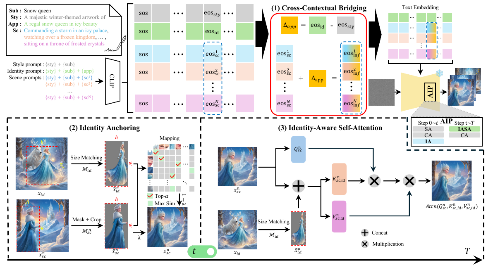
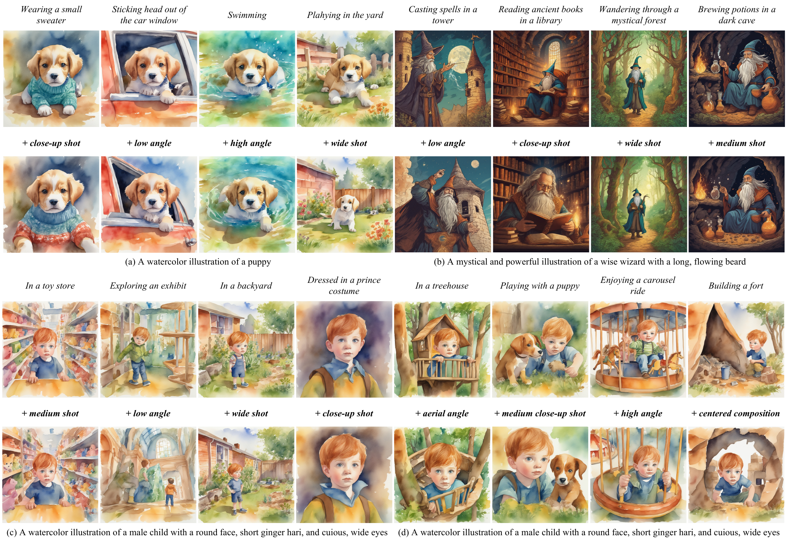
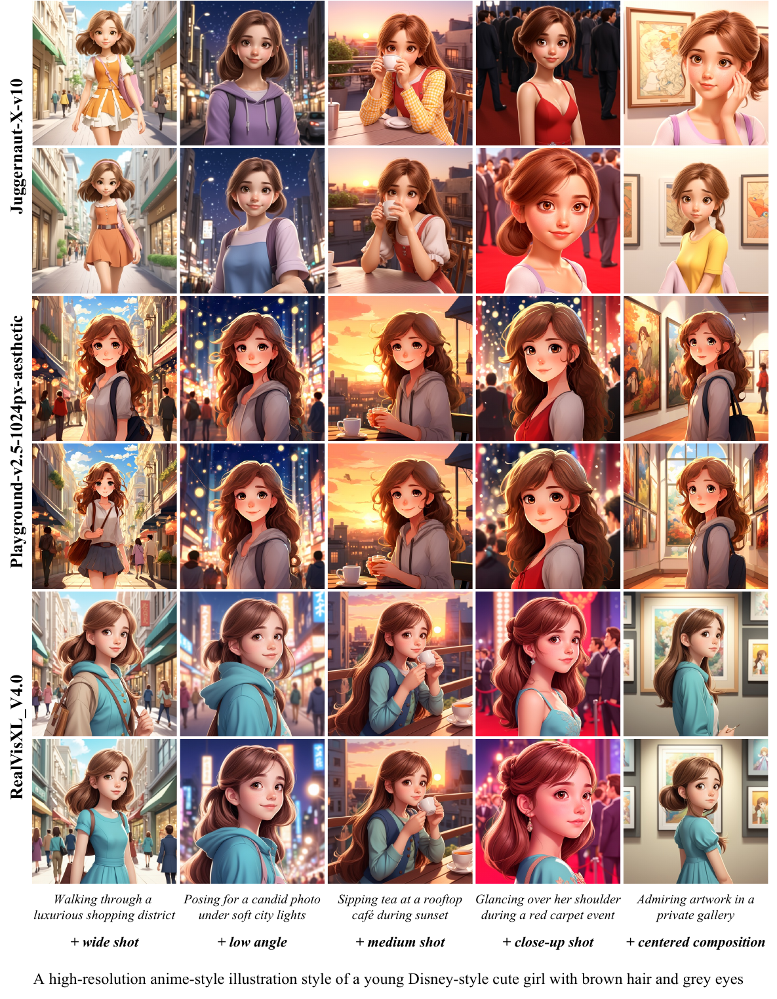
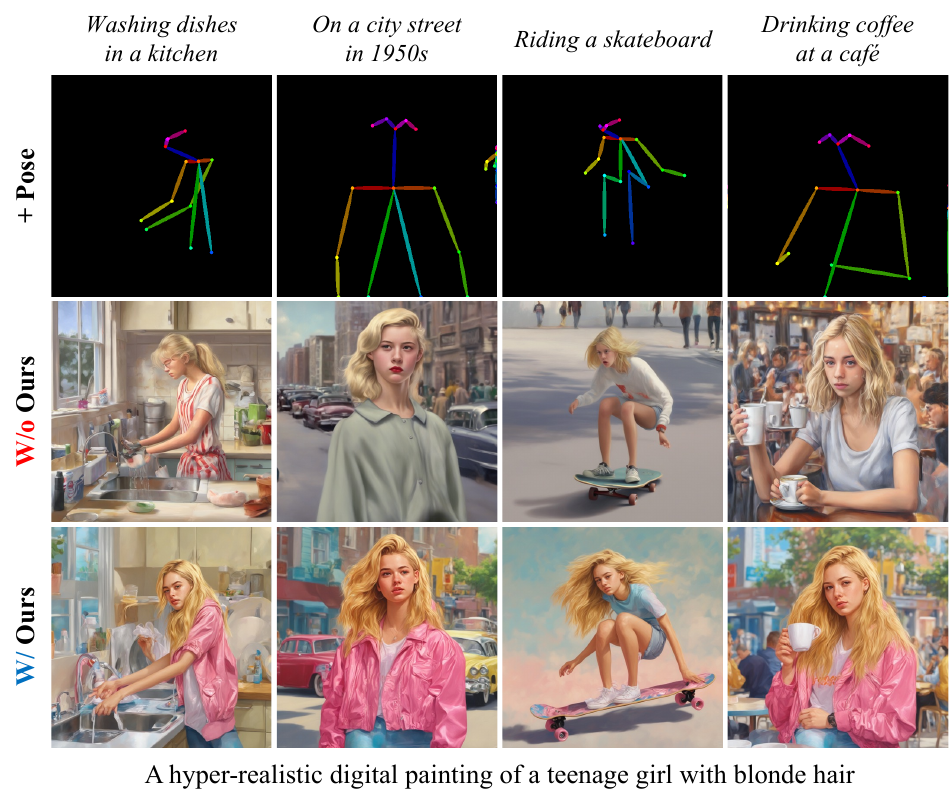
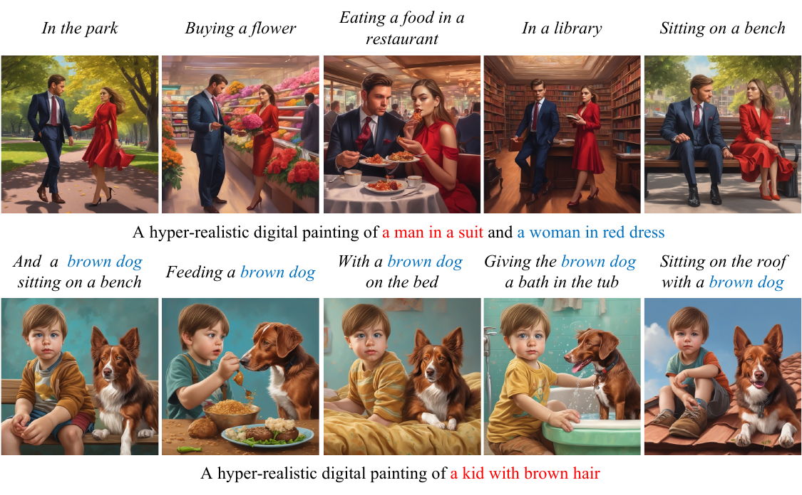

<div align="center">

# Not Just a Subject: Capturing Adaptive Scene-Specific Variance for Visual Storytelling

<h3>ACCV 2026&nbsp;&nbsp;</h3>

[*SeungJu Cha*](https://scholar.google.com/citations?hl=ko&view_op=list_works&gmla=AERr9JH6kYtVG33b8g1ZO2PpZ5xfSW33MIERzTGyYxcdDh8_d8z5GBEwTpCOZRoWWqQEDves1k4ZtWTRUTCHvPmKpRE5TzEvz5G5wjdBQzUZEJHYwrzoQAwOtZ2EHS0&user=lVmI_MgAAAAJ) ([LinkedIn](https://www.linkedin.com/in/seungju-cha-3a3061301/?isSelfProfile=true))&nbsp;·&nbsp;[*Ye-Chan Kim*](https://scholar.google.com/citations?user=HBHVFMIAAAAJ&hl=ko)&nbsp;·&nbsp;[*Kwanyoung Lee*](https://github.com/mobled37)&nbsp;·&nbsp;*Dong-Jin Kim*

**📄 Paper: coming soon · arXiv: coming soon**

<!-- Replace the line above with: [Paper](PAPER_URL) · [arXiv](ARXIV_URL) -->

<p align="center">
  
</p>

<p><b>EOS-Story pipeline.</b> Cross-Contextual Bridging captures scene-specific variance, while Identity Anchoring and Identity-Aware Self-Attention preserve subject identity throughout generation.</p>

</div>

---

## Qualitative Results

EOS-Story maintains subject identity across diverse scenes while responding to additional camera-angle and composition controls.

<p align="center">
  
</p>

## Official Implementation

This repository contains the official SDXL implementation of **EOS-Story**. It supports single-subject stories, multi-subject stories, and optional pose control with precomputed OpenPose maps.

EOS-Story combines three components:

- **Cross-Contextual Bridging (CCB)** transfers scene-specific appearance through EOS embeddings.
- **Identity Anchoring (IA)** anchors subject features during early denoising steps.
- **Identity-Aware Self-Attention (IASA)** preserves identity while retaining scene variation.

## Installation

Python 3.10 and a CUDA-capable NVIDIA GPU are recommended.

```bash
conda create -n eos-story python=3.10
conda activate eos-story
pip install -r requirements.txt
```

The SDXL checkpoint is downloaded from `stabilityai/stable-diffusion-xl-base-1.0` on first use. If authentication is required, log in with the Hugging Face CLI or set `HF_TOKEN`.

## Quick Start

Run commands from the repository root:

```bash
bash test.sh single
```

This generates the included single-subject phoenix story with two scenes, seed 12, and λ = 0.55.

Use `--dry_run` to validate inputs and output paths without loading SDXL:

```bash
bash test.sh single --dry_run
```

Set `PYTHON` when a specific environment is needed:

```bash
PYTHON=/path/to/env/bin/python bash test.sh single
```

## Custom Stories

Stories are defined in YAML. A single-subject story uses one `concept_token` and one `subject` description:

```yaml
animals:
  - concept_token: phoenix
    subject: a phoenix with bright orange feathers
    style: A fiery and majestic illustration of
    settings:
      - rising from fiery ashes
      - soaring through a glowing sky
```

Generate any benchmark with:

```bash
python run_eosstory.py --benchmark benchmark/consistory+.yaml
```

`generate_all.sh` runs every YAML file in `benchmark/`.

```bash
bash generate_all.sh
```

## Generation Settings

| Setting | Default |
| --- | --- |
| Backbone | SDXL-base-1.0 |
| Scheduler | EulerDiscreteScheduler |
| Resolution | 1024 × 1024 |
| Denoising steps | 50 |
| CFG scale | 7.0 |
| Seed | 12 |
| Identity Anchoring | Steps 2–9 |
| Identity-Aware Self-Attention | Steps 10–50 |
| Scene-preservation weight λ | 0.55 |
| EOS infusion | First EOS token |

Use `--seed` to change the random seed and `--sa_scale` to set λ in `[0, 1]`. ControlNet options are exposed through `--controlnet_model`, `--controlnet_scale`, `--control_guidance_start`, and `--control_guidance_end`.

## Code Structure

```text
EOS-Story_ACCV2026/
├── benchmark/               # Story definitions
├── poses/                   # Example OpenPose maps
├── figs/                    # README figures
├── results/                 # Generated scene images
├── run_eosstory.py          # Main generation flow
├── eosstory_utils.py        # YAML, prompt, token, latent, and I/O utilities
├── pipeline_eosstory.py     # SDXL pipeline and CCB
├── attention_processor.py   # IA and IASA
├── utils.py                 # Mask and correspondence helpers
├── test.sh
└── generate_all.sh
```

## Extensions

The same EOS-Story formulation supports pose-guided generation, different SDXL-family checkpoints, and stories containing multiple subjects.

<table>
  <tr>
    <td width="50%" rowspan="2" align="center" valign="top">
      <b>Model Variations</b><br>
      <sub>EOS-Story across Juggernaut-XL, Playground v2.5, and RealVisXL.</sub><br><br>
      
    </td>
    <td width="50%" align="center" valign="top">
      <b>OpenPose ControlNet</b><br>
      <sub>Pose guidance with consistent subject appearance.</sub><br><br>
      
    </td>
  </tr>
  <tr>
    <td width="50%" align="center" valign="top">
      <b>Multi-Subject Storytelling</b><br>
      <sub>Multiple identities preserved throughout a shared story.</sub><br><br>
      
    </td>
  </tr>
</table>

### Multi-Subject Generation

Use lists for `concept_token` and `subject`, keeping the same order and length. Each concept token must appear in its corresponding subject description.

```yaml
multi_characters:
  - concept_token: [man, woman]
    subject: [a man in a suit, a woman in a red dress]
    style: A hyper-realistic digital painting of
    settings:
      - with a woman in the park
      - buying a flower with a woman
```

Run the included multi-subject example with seed 44 and λ = 0.6:

```bash
bash test.sh multi
```

### OpenPose ControlNet Generation

EOS-Story accepts precomputed OpenPose maps and does not extract poses from source photographs. Pose paths in YAML are resolved relative to the YAML file.

```yaml
humans:
  - concept_token: man
    subject: a man in a suit
    style: A hyper-realistic digital painting of
    settings:
      - standing in a park
      - sitting on a bench in a park
    pose:
      - ../poses/person_openpose.png
      - ../poses/sitting_openpose.png
```

Run the included pose-guided example with:

```bash
bash test.sh pose
```

One map may be shared by all scenes, supplied once per scene in `settings` order, or supplied once per generated identity and scene with the identity maps first. Command-line `--pose` paths override the YAML values.

Run the single-subject, multi-subject, and ControlNet examples together with:

```bash
bash test.sh all
```

## Acknowledgments

The SDXL pipeline is adapted from Hugging Face Diffusers. Identity-Aware Self-Attention builds on [Consistory](https://github.com/NVlabs/consistory). Our `Consistory+_+` benchmark is built using both [One-Prompt-One-Story](https://github.com/byliutao/1Prompt1Story) and [ShotBench](https://github.com/Vchitect/ShotBench). Upstream attribution and licenses are included in `NOTICE` and `THIRD_PARTY_LICENSES/`.

## Citation

To be released.
